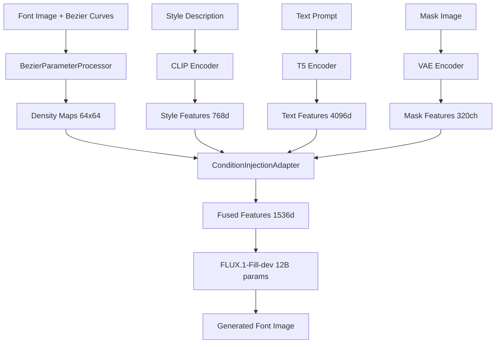

# 🎯 FLUX Fill Training Guide

## Overview: What You're Training

You're training a **BezierAdapter** that works with **FLUX.1-Fill-dev** to generate fonts with precise Bezier curve control. Here's what happens:



## Phase 1: Understanding Each Training Step

### 🔥 What Happens During One Training Step

#### Step 1: Data Loading
```python
# The trainer loads a batch of data containing:
batch = {
    'image': torch.tensor,          # Target font image (512x512)
    'style_image': torch.tensor,    # Reference style image
    'mask': torch.tensor,           # Inpainting mask (320 channels for Fill model)
    'bezier_points': torch.tensor,  # Control points [(x1,y1), (x2,y2), ...]
    'text_prompt': str,             # "elegant serif letter A"
    'style_prompt': str             # "modern typography, clean lines"
}
```

**Why this matters**: Each sample teaches the model how Bezier curves relate to the final font appearance.

#### Step 2: Multi-Modal Feature Extraction
```python
# 1. Process Bezier curves into density maps
density_map = bezier_processor(bezier_points)  # Shape: [B, 1, 64, 64]

# 2. Extract text features
text_features = t5_embedder(text_prompt)       # Shape: [B, 4096]

# 3. Extract style features  
style_features = clip_embedder(style_prompt)   # Shape: [B, 768]

# 4. Process mask for Fill model
mask_features = vae_encoder(mask)              # Shape: [B, 320, 64, 64]
```

**Why this matters**: The model learns to understand fonts through multiple modalities - visual, textual, and geometric.

#### Step 3: Condition Fusion
```python
# Fuse all modalities into unified representation
conditions = MultiModalCondition(
    style_features=style_features,
    text_features=text_features,
    mask_features=mask_features,
    bezier_features=density_map
)

fused_features = condition_adapter(conditions)  # Shape: [B, 1536]
```

**Why this matters**: This is where the magic happens - the model learns to combine geometric constraints (Bezier) with semantic understanding (text/style).

#### Step 4: FLUX Forward Pass
```python
# The model generates the font image
noise = torch.randn_like(target_latent)
timestep = torch.randint(0, 1000, (batch_size,))

# FLUX.1-Fill-dev with BezierAdapter hooks
predicted_noise = model(
    x=noise,
    timestep=timestep,
    text_embeddings=text_features,
    bezier_conditions={
        'conditions': fused_features,
        'density_map': density_map
    }
)
```

**Why this matters**: The model learns to generate images that match both the text description AND the Bezier curve constraints.

#### Step 5: Loss Computation
```python
# Multi-loss training combines 3 objectives:

# 1. Diffusion Loss (main objective)
diffusion_loss = F.mse_loss(predicted_noise, true_noise)

# 2. Density Loss (Bezier adherence)
density_loss = compute_kde_loss(generated_features, bezier_density)

# 3. Style Loss (style consistency) 
style_loss = compute_style_loss(generated_image, style_image)

# Combined loss
total_loss = (1.0 * diffusion_loss + 
              0.3 * density_loss + 
              0.5 * style_loss)
```

**Why this matters**: 
- **Diffusion loss**: Ensures high image quality
- **Density loss**: Ensures the output follows Bezier curves
- **Style loss**: Ensures style consistency

#### Step 6: Backward Pass & Updates
```python
# Only update BezierAdapter parameters (21.1M out of 12B+)
scaler.scale(total_loss).backward()
scaler.step(optimizer)  # Updates only unfrozen parameters
scheduler.step()        # Learning rate scheduling
```

**Why this matters**: Parameter-efficient training - we only train 1.8% of the model while keeping FLUX frozen.

## Phase 2: Training Configurations Explained

### 🏃‍♂️ Development Config (Quick Testing)
```bash
python train_fill_model.py \
    --data_root sample_dataset \
    --config_type development \
    --batch_size 1 \
    --total_steps 100
```

**What this does**:
- **100 steps**: Quick validation that everything works
- **Batch size 1**: Minimal memory usage
- **Fast logging**: Every 10 steps
- **Purpose**: Debug and validate setup

### 🚀 Production Config (Full Training)
```bash
python train_fill_model.py \
    --data_root real_dataset \
    --config_type full \
    --batch_size 2 \
    --total_steps 50000 \
    --mixed_precision
```

**What this does**:
- **50,000 steps**: Full training for high quality
- **Batch size 2**: Optimized for 24GB VRAM
- **Mixed precision**: bf16 for memory efficiency
- **Purpose**: Production-quality model

## Phase 3: Understanding the Logs

### 📊 What the Training Logs Mean

```
Step 100/50000 | Loss: 0.145 | D: 0.098 | Dens: 0.032 | Style: 0.015 | LR: 1e-4 | Time: 2.3s
```

**Breakdown**:
- **Step 100/50000**: Current progress
- **Loss: 0.145**: Total combined loss (lower = better)
- **D: 0.098**: Diffusion loss (image quality)
- **Dens: 0.032**: Density loss (Bezier adherence)
- **Style: 0.015**: Style loss (style consistency)
- **LR: 1e-4**: Current learning rate
- **Time: 2.3s**: Time per step

### 📈 What Good Training Looks Like

**Healthy Training Signs**:
```
Step    | Total Loss | Diffusion | Density | Style
--------|------------|-----------|---------|-------
0       | 2.150      | 1.850     | 0.200   | 0.100
1000    | 0.845      | 0.650     | 0.125   | 0.070
5000    | 0.456      | 0.320     | 0.086   | 0.050
10000   | 0.298      | 0.195     | 0.065   | 0.038
25000   | 0.187      | 0.112     | 0.048   | 0.027
```

**What this means**:
- **Decreasing trend**: Model is learning
- **Density loss drops**: Better Bezier adherence
- **Style loss drops**: Better style consistency
- **No sudden spikes**: Stable training

## Phase 4: Memory and Performance

### 💾 Memory Usage Breakdown

**FLUX.1-Fill-dev Model**:
- Base model: ~24GB (frozen, loaded once)
- Gradients: 0GB (frozen parameters)

**BezierAdapter**:
- Parameters: ~84MB (21.1M × 4 bytes)
- Gradients: ~84MB 
- Optimizer states: ~252MB (AdamW needs 3x)

**Training Batch**:
- Images (512×512×3): ~3MB per image
- Latents (64×64×16): ~0.2MB per image
- Text features: ~0.05MB per image

**Total Training Memory**:
- **Batch size 1**: ~25GB
- **Batch size 2**: ~26GB
- **Batch size 4**: ~28GB

### ⚡ Performance Optimization

**Speed Optimizations**:
```python
# 1. Mixed Precision (2x speedup)
--mixed_precision

# 2. Gradient Checkpointing (memory for speed tradeoff)
config.model.use_gradient_checkpointing = True

# 3. Torch Compile (1.5x speedup on modern GPUs)
--compile_model

# 4. Efficient Data Loading
config.data.num_workers = 4
config.data.pin_memory = True
```

## Phase 5: Troubleshooting Common Issues

### 🔧 Common Problems & Solutions

#### Problem: Out of Memory
```
RuntimeError: CUDA out of memory. Tried to allocate 2.34 GiB
```

**Solutions**:
1. Reduce batch size: `--batch_size 1`
2. Enable gradient checkpointing (already enabled)
3. Reduce image resolution: `config.data.image_size = 256`

#### Problem: Loss Not Decreasing
```
Step 1000 | Loss: 2.145 (not improving)
```

**Solutions**:
1. Check learning rate: `--learning_rate 5e-5` (lower)
2. Increase warmup: `config.optimization.warmup_steps = 2000`
3. Check data quality: Ensure Bezier curves match images

#### Problem: Density Loss Stuck High
```
Density loss stuck at 0.200+
```

**Solutions**:
1. Check Bezier curve normalization
2. Adjust KDE bandwidth: `config.bezier_processor.kde_bandwidth_init = 0.05`
3. Increase density loss weight: `config.loss.density_loss_weight = 0.5`

## Phase 6: Monitoring Training

### 📱 TensorBoard Monitoring

**Launch TensorBoard**:
```bash
tensorboard --logdir outputs/production_training/logs
```

**Key Metrics to Watch**:
1. **train/total_loss**: Should decrease steadily
2. **train/diffusion_loss**: Primary quality metric
3. **train/density_loss**: Bezier adherence metric
4. **train/style_loss**: Style consistency metric
5. **val/total_loss**: Validation performance
6. **learning_rate**: Should follow schedule

### 🎯 Success Criteria

**Training is successful when**:
- Total loss < 0.2 after 25k steps
- Density loss < 0.05 (good Bezier adherence)
- Style loss < 0.03 (good style consistency)
- Validation loss stable (not overfitting)

**Model is ready when**:
- Generated fonts clearly follow Bezier curves
- Style transfer produces coherent results
- Text prompts are accurately reflected
- No artifacts or quality issues

## Next Steps After Training

### 🎨 Testing Your Trained Model

```bash
python example_bezier_pipeline.py \
    --model_path outputs/production_training/checkpoints/best_model.pt \
    --character A \
    --style "elegant serif" \
    --output generated_A.png
```

This guide covers the complete training process. Each step builds understanding of how Bezier curves can control font generation through the powerful FLUX diffusion model!